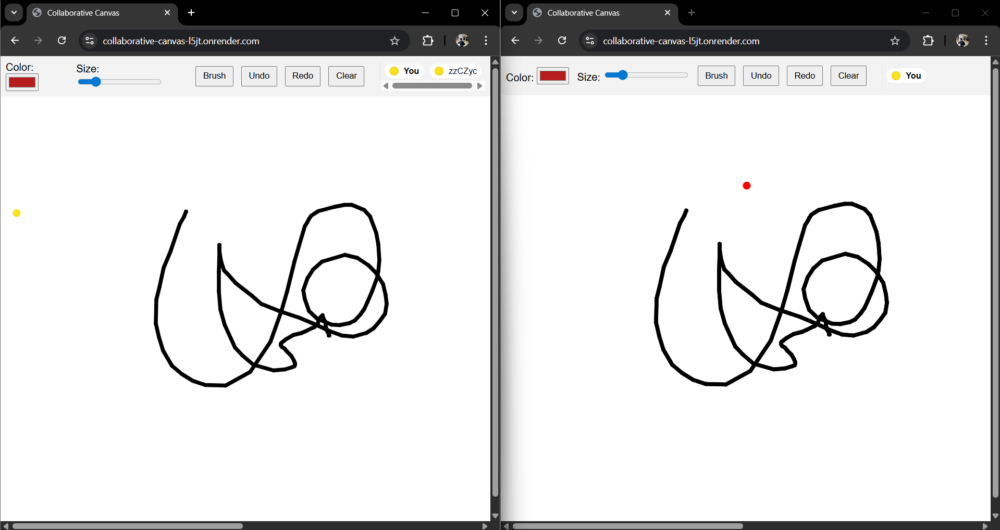

# Collaborative Canvas

A **real-time multi-user drawing application** built with **Vanilla JavaScript**, **HTML5 Canvas**, and **Node.js (Socket.io)**.  
Multiple users can draw simultaneously, see each other's strokes in real time, undo/redo globally, and track active users with color indicators.

---

## 🚀 Features

✅ Real-time synchronized drawing across users  
✅ Global Clear (clears everyone's canvas)  
✅ Global Undo/Redo (per-user LIFO)  
✅ Live cursor indicators showing other users' positions  
✅ Brush, color picker, and eraser tool  
✅ Adjustable stroke width  
✅ Users assigned unique colors  
✅ New users instantly see the full current canvas  
✅ Simple UI — no frameworks or drawing libraries  
✅ Auto-reset canvas on first user join (fresh session)

---

## 🎨 Live Collaboration Example

The screenshot below shows **two users drawing simultaneously** on the same canvas with **real-time synchronization**:



---

## 🧩 Project Structure

```
collaborative-canvas/
├── client/
│   ├── index.html
│   ├── style.css
│   ├── canvas.js
│   ├── websocket.js
│   └── main.js
├── server/
│   └── server.js
├── assets/
│   └── collaborative-demo.png
├── package.json
├── README.md
└── ARCHITECTURE.md
```

---

## ⚙️ Setup Instructions

### 1. Clone the repository
```bash
git clone https://github.com/tagore19/collaborative-canvas.git
cd collaborative-canvas
```

### 2. Install dependencies
```bash
npm install
```

### 3. Run locally
```bash
npm run dev
```
Then open your browser and visit:
```
http://localhost:3000
```

---

## 🌐 Live Demo

Deployed on **Render**:  
👉 [https://collaborative-canvas-l5jt.onrender.com](https://collaborative-canvas-l5jt.onrender.com)

---

## 🧪 How to Test Multi-user Collaboration

1. Open the live URL or `http://localhost:3000` in two tabs.  
2. Draw in one — strokes appear instantly in the other.  
3. Click **Clear** in one tab — both canvases clear immediately.  
4. Use **Undo/Redo** to revert your strokes globally.  
5. Move your cursor — see others' cursors in real time.  
6. Each user is assigned a distinct color and name in the toolbar.

---

## ⚖️ Known Limitations

- Canvas resets when first user connects (session start).  
- Undo/Redo are per-user, not cross-user.  
- In-memory storage only (no database persistence).  
- No authentication (identifies users by socket ID).  
- Replay clears and redraws all strokes (O(n) cost).

---

## 🧠 Tech Stack

- **Frontend:** Vanilla JavaScript, HTML5 Canvas, Socket.io client  
- **Backend:** Node.js, Express, Socket.io  
- **Deployment:** Render (Node 22, Express static server)  

---

## 💬 Author

**Name:** Tagore Reddy  
**Email:** tagorepasham@gmail.com  
**GitHub:** [https://github.com/tagore19](https://github.com/tagore19)  
**Project:** Real-Time Collaborative Drawing Canvas Assignment
